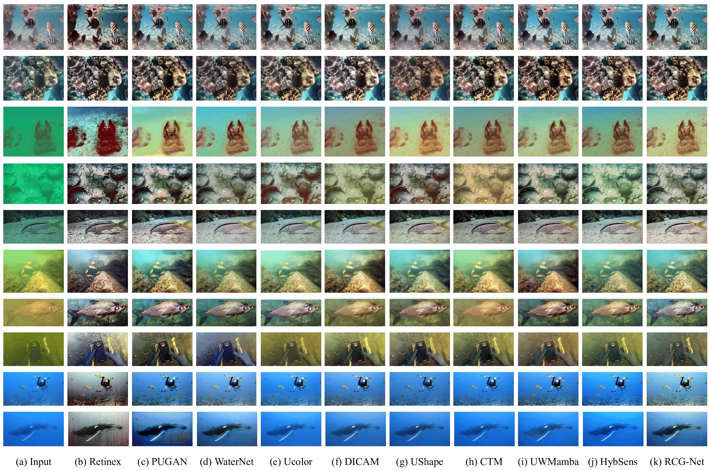
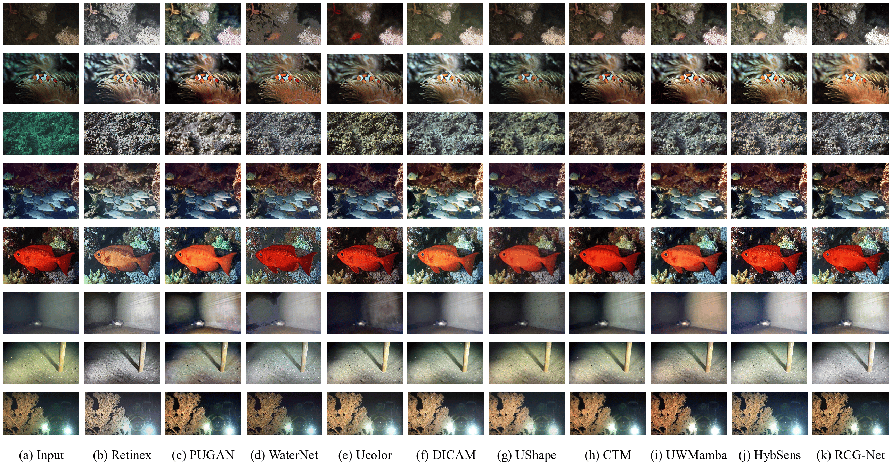
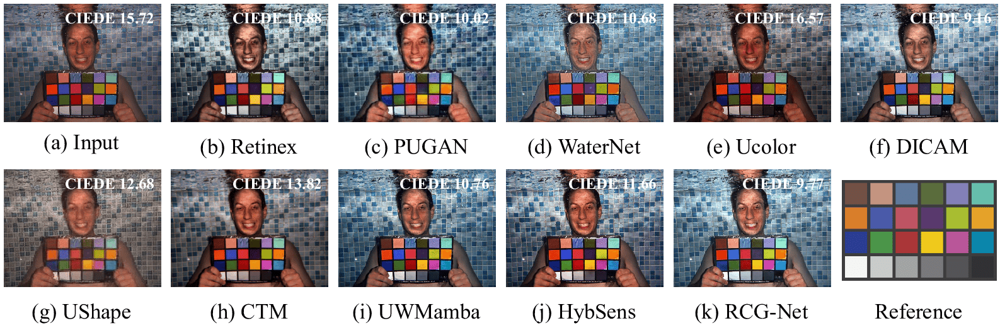

+ **Our code** is in the folder of "RCG-Net". We will upload this once our paper is received. There're training sets now.  
+ **5 testing sets** and **1 testing set with varying noise types & levels** used in our paper are shown in the folder of "TestingSet"
+ **The output of our RCG-Net** is shown in the folder of "RCG-Net-output"  
+ **Codes and results of 13 SOTA UIE methods** are shown in the folder of "Comparison", some of their checkpoints are too large for us to upload, but you can get them from the link in their paper.
+ Results of all methods under varying noise types & levels are shown in the folder of "Comparison_under_noise"
+ **The codes of all IQA metrics** used in our paper **(PSNR & SSIM & UIQM & UCIQE & NIQE & URanker)** are given in the folder of "IQA_Evaluation". The subfolder "OtherNotUsedInPaper" also includes some metrics we didn't use like LPIPS & NUIQ.
+ **The results of Ablation Study** including the structure and loss are in the folder of "Ablation Study"

# The objective results of all 13 methods
We compared RCG-Net with 13 UIE methods to demonstrate the superiority of our approach. These methods include two restoration method based on physical models: **GDCP (2018)** and **Retinex (2014)**; two traditional methods based on non-physical models: **Fusion (2012)** and **ZSRM (2024)**; nine data-driven and hybrid methods: **FUnIE-GAN (2020)** (GAN-based), **PUGAN (2023)** (a physical model guided GAN), **WaterNet (2019)** (CNN-based), **Ucolor (2021)** (CNN + GDCP), **DICAM (2024)** (CNN based), **U-Shape Transformer (2023)** (Transformer-based), **CTM (2024)** (Transformer + CNN), **UWMamba (2024)** (Mamba + CNN), and **GuidedHybSensUIR (2025)** (Color Balance Prior + CNN + Transformer) (which we denote as HybSens). 

Due to space constraints and their relatively poor performance, GDCP, Fusion, ZSRM, and FUnIE were excluded from the quantitative and qualitative comparisons in our paper. But we have shown the results of all 13 methods below.(You can also seen the complete results in the folder of "Comparison"~)

## 1. Evaluation in Common and Challenging Degradation Scenarios
#### The objective results of 4 methods that didn't present in the paper:

#### The objective results of 9 better methods that have presented in the paper:

## 2. Evaluation in Lighting Degradation Scenarios
#### The objective results of 4 methods that didn't present in the paper:

#### The objective results of 9 better methods that have presented in the paper:

## 3. Evaluation on Color Restoration Accuracy
#### The objective results of 4 methods that didn't present in the paper:

#### The objective results of 9 better methods that have presented in the paper:

